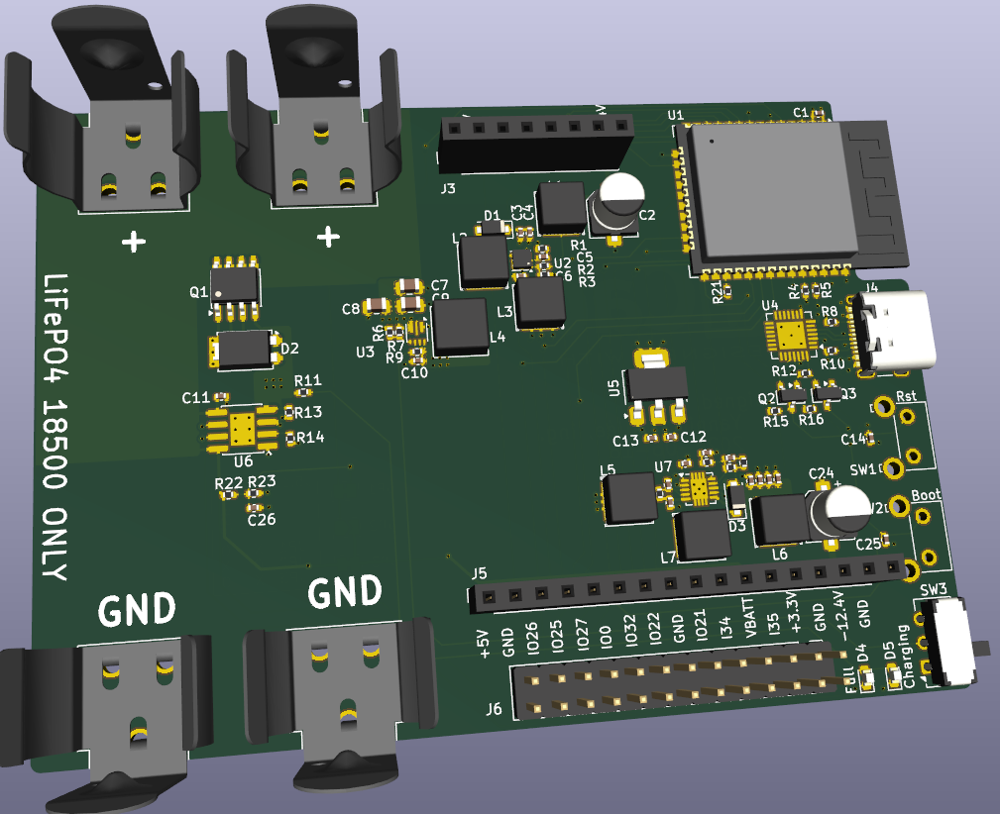

The goals of this BaseBoard:
* Support Bluetooth legacy for receiving audio from an external audio source
* Support 2x 18650 LiFePo4 cell that can be charged with the USB connector
* Low noise +/- 12.4V going to the mezzanine to powered Audio op-amp
* I2S port going to the mezz
* Support of the MHS 4.0 screen (ST7796S) with touch (XPT2046)
* can be placed inside an Pelican 1040 Micro Case

